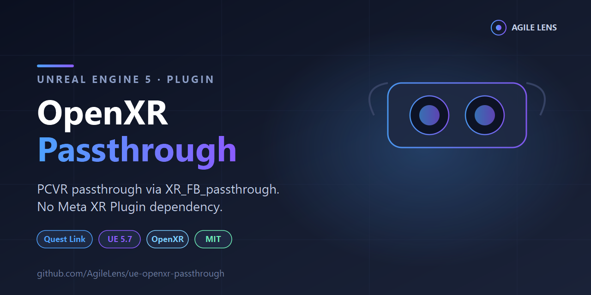

# UE OpenXR Passthrough



A lightweight Unreal Engine plugin that enables Meta Quest **passthrough on PCVR (Quest Link / Air Link)** using the raw `XR_FB_passthrough` OpenXR extension — **without** taking a dependency on the Meta XR Plugin (OculusXR).

Useful if you want passthrough in your PCVR project but want to stay on vanilla OpenXR for portability, avoid vendor SDK lock-in, or ship to non-Meta targets from the same codebase.

## What It Does

- Registers as an `IOpenXRExtensionPlugin` — automatically picked up by UE's OpenXR runtime, no manual wiring
- Requests `XR_FB_passthrough` and `XR_EXT_composition_layer_inverted_alpha` as optional extensions (gracefully degrades if unavailable)
- Auto-detects PCVR vs standalone by checking supported blend modes:
  - **PCVR (OPAQUE only):** creates a fullscreen `XR_FB_passthrough` layer as a compositor underlay, flips `xr.OpenXRInvertAlpha` / `OpenXR.AlphaInvertPass` CVars so UE's alpha convention (0 = opaque) renders correctly through Quest Link
  - **Standalone Quest (ALPHA_BLEND available):** defers to engine-native alpha blending — this plugin does nothing, as standalone doesn't need `XR_FB_passthrough`
- Exposes a runtime toggle: `SetPassthroughEnabled(bool)` on the module
- Handles `XR_FB_passthrough` state events (reinit required, non-recoverable errors)

## Why This Exists

The official path for Quest Link passthrough in UE is the Meta XR Plugin, which is a ~500 MB dependency and pulls in a lot of Meta-specific code. If your project is OpenXR-first and you want to keep your plugin surface minimal, this is a ~500-line alternative that does one thing well.

## Requirements

- Unreal Engine **5.1+** (developed and tested on 5.7)
- Windows 64-bit (`Win64` only — see Platform Support below)
- Meta Quest with Quest Link / Air Link enabled, Oculus PC app installed
- UE's built-in OpenXR plugin enabled (`OpenXR`)

## Platform Support

**Win64 only.** This plugin is unnecessary (and disabled at build time) on other platforms:

- **Standalone Quest / Android:** use engine-native alpha-blend passthrough via `SetEnvironmentBlendMode(AlphaBlend)` in Blueprint/C++
- **Other PCVR runtimes (SteamVR, etc.):** `XR_FB_passthrough` is Meta-specific; those runtimes don't expose it

## Installation

1. Clone or copy into your project's `Plugins/` folder:
   ```
   YourProject/
     Plugins/
       OpenXRPassthrough/        <-- this folder
   ```
2. Regenerate project files (right-click `.uproject` → **Generate Visual Studio project files**)
3. Rebuild. The plugin is `EnabledByDefault: true` and registers itself automatically.

Or as a git submodule:
```bash
cd YourProject/Plugins
git submodule add https://github.com/AgileLens/ue-openxr-passthrough.git OpenXRPassthrough
```

## Usage

Once installed, passthrough activates automatically when the OpenXR session starts on PCVR. No Blueprint wiring needed for the base case.

### Runtime toggle (optional)

```cpp
#include "OpenXRPassthrough.h"

// Somewhere with module access
auto& Module = FModuleManager::LoadModuleChecked<FOpenXRPassthroughModule>("OpenXRPassthrough");
Module.SetPassthroughEnabled(true);   // resume
Module.SetPassthroughEnabled(false);  // pause

if (Module.IsPassthroughAvailable()) { /* extension present */ }
if (Module.IsPassthroughEnabled())   { /* currently running */ }
```

To expose this to Blueprints, wrap the module calls in a `UBlueprintFunctionLibrary` in your project.

### Scene transparency

For scene geometry to composite correctly over passthrough, your materials/scene must output **alpha = 0 where you want passthrough to show through** (UE's convention). The plugin handles the alpha inversion needed for Quest Link at the compositor level — you just need to make sure your background/sky/masked surfaces write zero alpha.

## How It Works (For the Curious)

Standalone Quest supports `XR_ENVIRONMENT_BLEND_MODE_ALPHA_BLEND`, so UE's native path (`SetEnvironmentBlendMode(AlphaBlend)`) works. Quest Link, however, only reports `OPAQUE` — the Meta compositor on the Quest side doesn't forward alpha-blend semantics over Link.

The workaround: instead of relying on the environment blend mode, this plugin creates an `XR_FB_passthrough` fullscreen layer and inserts it as an **underlay** (index 0) in the composition layer list each frame. The projection layer then gets `BLEND_TEXTURE_SOURCE_ALPHA_BIT | UNPREMULTIPLIED_ALPHA_BIT` set so the compositor uses the projection layer's alpha to reveal the passthrough underneath.

Quest Link also doesn't support `XR_EXT_composition_layer_inverted_alpha`, so the plugin disables `xr.OpenXRInvertAlpha` (the compositor-level hint) and enables `OpenXR.AlphaInvertPass` (a render pass that flips alpha in-pixel before swapchain submission) to translate UE's 0=opaque convention into the 1=opaque convention the compositor expects.

## License

MIT — see [LICENSE](LICENSE).

## Contributing

Issues and PRs welcome. This was extracted from a working project (Quest 3 + Galaxy XR co-location app) so it's pragmatic, not exhaustive — missing features or rough edges very possible. File an issue if something's off.

## Credits

Built by [Agile Lens](https://www.agilelens.com) for the MarkerPlugin co-location project. Extracted as a standalone plugin so the rest of the UE XR community can skip the Meta XR Plugin dependency for basic passthrough.
